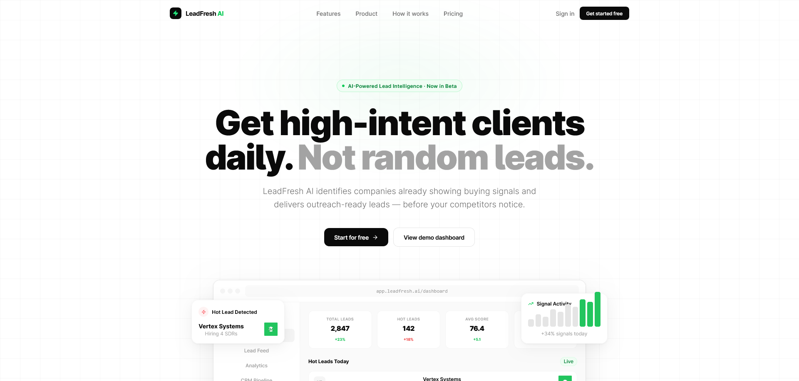
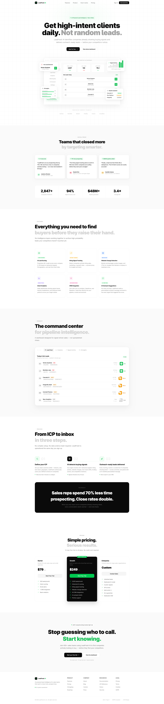
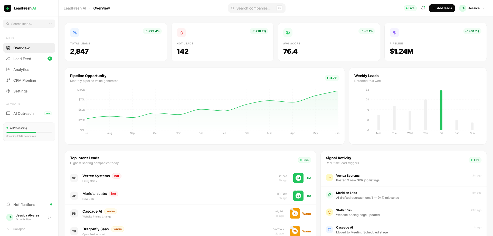

# LeadFresh AI

<p align="center">
  
</p>

<h1 align="center">
  Get high-intent clients daily.<br/>
  Not random leads.
</h1>

<p align="center">
  LeadFresh AI identifies companies already showing buying signals and delivers outreach-ready leads through AI-powered intent analysis.
</p>

---

<p align="center">
  
  
  
  
  
</p>

---

# Overview

LeadFresh AI is a premium AI-powered SaaS dashboard and landing experience designed for modern sales teams, agencies, and high-growth companies.

The platform detects real buying intent using:
- hiring activity
- website changes
- funding signals
- CRM patterns
- technology stack updates
- behavioral intelligence

Instead of generating random cold leads, LeadFresh AI surfaces businesses already likely to convert.

---

# Design Philosophy

This project was designed with a strong focus on:

- Product Thinking
- Minimal Architecture
- Motion-Driven UI
- Enterprise SaaS Patterns
- Premium Interaction Design
- Clean Typography
- Scalable Frontend Systems

The visual direction is inspired by:
- Linear
- Vercel
- Stripe
- Resend
- Raycast
- Notion

---

# Features

## AI Lead Intelligence
Analyze real-time buying intent signals using AI-powered scoring systems.

## Intent Tracking
Track company activity including:
- hiring growth
- website updates
- funding news
- product launches

## Enterprise Dashboard
Modern dashboard architecture with:
- analytics
- activity feeds
- charts
- AI insights
- CRM status
- lead scoring

## Responsive Experience
Fully optimized for:
- desktop
- tablet
- mobile

## Modern Motion System
Subtle, premium interactions powered by Framer Motion.

## Design System Architecture
Reusable UI structure built with scalable component-driven patterns.

---

# Tech Stack

| Technology | Usage |
|---|---|
| Next.js 15 | Frontend Framework |
| TypeScript | Type Safety |
| TailwindCSS | Styling System |
| Framer Motion | Motion & Interactions |
| shadcn/ui | UI Components |
| Zustand | State Management |
| React Query | Data Fetching |
| Recharts | Analytics & Charts |

---

# UI System

The interface is built around:
- clean spacing systems
- grayscale palettes
- subtle green accents
- architectural layouts
- oversized typography
- modular UI blocks

---

# Folder Structure

```bash
src/
├── app/
├── components/
│   ├── dashboard/
│   ├── landing/
│   ├── ui/
│   └── motion/
├── hooks/
├── lib/
├── store/
├── styles/
└── types/

Motion & Interaction

The motion system focuses on:

smooth fade transitions
staggered content reveals
floating UI movement
premium hover states
intentional micro interactions

Animations are intentionally subtle to preserve a refined product experience.

Responsive Design

LeadFresh AI was designed mobile-first and optimized across:

ultra-wide displays
laptops
tablets
mobile devices
Screenshots
Landing Experience
<p align="center">  </p>
AI Dashboard
<p align="center">  </p>
Why This Project Exists

Modern SaaS products are no longer judged only by functionality.

They are judged by:

clarity
interaction quality
visual systems
responsiveness
motion
product experience

LeadFresh AI was built as a modern frontend engineering and product design showcase focused on those principles.

Performance Goals
Fast page transitions
Optimized rendering
Accessible components
Clean architecture
Scalable patterns
Production-ready structure
Future Improvements
AI-generated outreach
Team collaboration
CRM integrations
Real-time notifications
Dark/light personalization
Advanced analytics
Local Development
# Install dependencies
npm install

# Start development server
npm run dev
Build Production
npm run build
Author
Alireza Ghaffari

Creative Frontend Engineer & UI/UX Designer

Portfolio: https://alireza.paarlastudio.com
LinkedIn: https://linkedin.com/in/alireza-ghaffari-164b4235a
GitHub: https://github.com/alirezahosseini
Final Note

This project is part of a broader exploration into:

modern frontend architecture
premium SaaS experiences
product-focused UI systems
motion-driven interfaces
scalable design engineering

Built with attention to detail, interaction quality, and modern digital aesthetics.